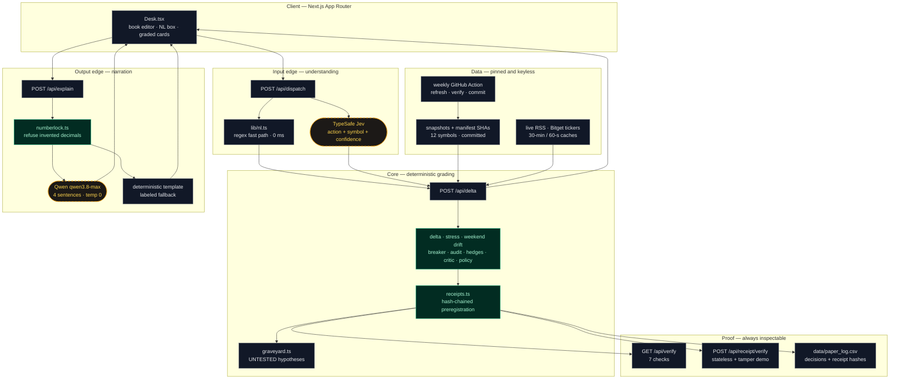
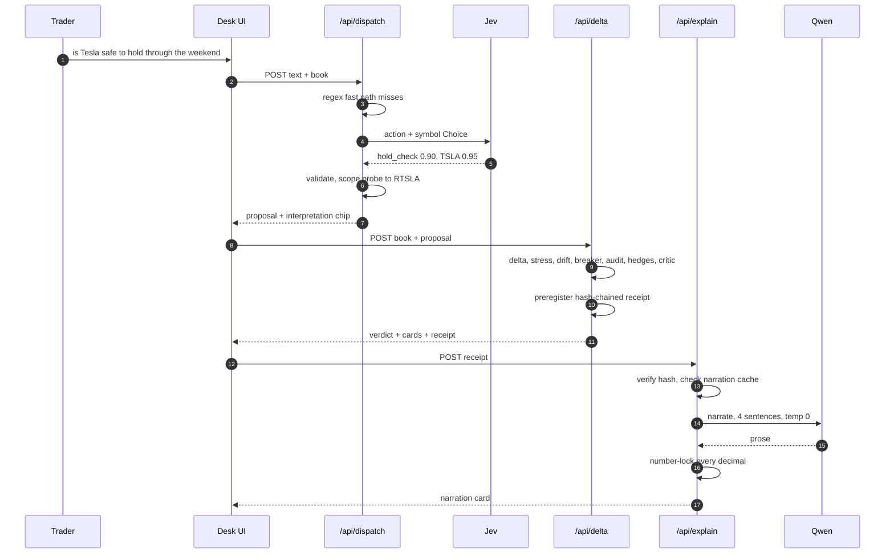

# Weekend Copilot

**Portfolio-aware AI trading desk for tokenized US stocks (Bitget rTokens).**
Bitget AI Base Camp Hackathon S2 · Track 3: AI Trading Desk → Open Theme (portfolio-aware AI PM)

[Live demo](https://weekend-copilot.vercel.app) · [Proof endpoint](https://weekend-copilot.vercel.app/api/verify) · [Graveyard](https://weekend-copilot.vercel.app/api/graveyard)

---

## The problem

Tokenized US stocks (rTokens) made prices 24/7. They did not make *wisdom* 24/7. Two blind spots compound for retail holders:

1. **Every signal is book-blind.** "Buy NVDA" means opposite things to a trader already 63% NVDA and to a balanced-ETF holder. No tool answers the question that actually matters: *what does this trade do to the book I already have?*
2. **Weekends are invisible risk.** When NYSE is closed, rTokens keep printing against internal liquidity — indicative prices, ±20% weekend bands, auto-cancelled limits, frozen oracles. On Monday there is a re-anchor gap. Holders cannot see that risk as a number, and every AI tool cheerfully recommends adding.

**Core hypothesis:** the scarce asset in 24/7 tokenized markets is not another signal — it is *position-aware, regime-aware restraint with receipts*. So we built the desk that grades the trade you are about to make against the book you actually hold, prices the weekend explicitly, and files a verifiable receipt before the outcome.

## What it does

| Layer | What happens | Why it is different |
|---|---|---|
| **Portfolio delta** | Weight-blended beta vs SPY, HHI concentration, sector weights, max pairwise correlation, promo-fee math — all deterministic | Answers change with the book. Same trade → TRIM on a concentrated book, PROCEED on a diversified one |
| **Measured weekend read** | Fri→Sun drift distribution from **real rToken 24/7 prints** (Bitget public candles) + 2y native-proxy Fri→Mon gaps, close→close proxies labeled per event | Not a vibe: 31 measured in-token weekends for NVDA, high confidence |
| **Breaker (kill switch in code)** | Every proposal re-run at **2× costs** against the 10 worst historical weekends; concentration and beta-add limits | A risk limit inside a prompt is a suggestion. This one cannot be argued with — it lives in code |
| **Three-way hedge compare** | Full size vs half-now/half-Monday vs illustrative FCN-style earn-while-you-wait, sorted by left-tail net P10 | Shows restraint as an *expression*, not a lecture |
| **Plain-English proposals** | Deterministic parser: `add 10 rNVDA`, `trim half my TSLA`, `sell all rMETA`, `should I hold over the weekend?` (labeled 25%-trim probe) | LUI without hallucination risk: unparseable input gets a hint, never a trade |
| **Weekend headlines** | Keyless CNBC/MarketWatch RSS, tagged by transmission channels (FED_RATES, TRADE_POLICY, AI_DEMAND, EARNINGS, GEOPOLITICS, MARKET_STRESS), weekend-window flagged | "What printed while New York slept" — with deterministic tags, no sentiment black box |
| **Honesty audit** | PSR / Deflated Sharpe / MinTRL (Bailey & López de Prado). DSR is *withheld* unless you declare how many variants you tried | We audit our own sleeve and report INCONCLUSIVE — because trailing Sharpe cannot justify a weekend add |
| **Critic + Hypothesis Graveyard** | Every decision files exactly one regime-tagged rule as UNTESTED until Monday. Rejected ideas persist as memory | Negative results are the most undervalued asset in quant research. Ours compound |
| **Preregistered receipts** | Hash-chained, written *before* the outcome, self-contained so any server instance re-verifies. The verify endpoint ships a doctored copy whose hash fails | Compare Monday — no moved goalposts. Receipts, not screenshots |
| **AI transmission (number-locked)** | Qwen narrates the analyst note; every decimal must match a locked engine fact or the whole response is refused and the deterministic template is served | The LLM writes sentences. Code writes numbers. Enforcement is mechanical, not aspirational |

## The 60-second judge path

1. Open the demo → the header tape streams **live Bitget rToken prices** (keyless).
2. Type **"add 10 rNVDA"** → verdict **Trim, or wait.** — beta 1.72→1.74, HHI 0.52, Semis 68%, measured in-token P10 −1.49%, breaker FLAG at 2× costs.
3. Click **"Same trade, different book →"** → the Balanced QQQ book returns **Proceed, with limits.** Same signal, opposite advice. That is the product.
4. Click **"Re-verify receipt"** → hash recomputes on any instance; the doctored copy reports `verifies: false`.
5. `pnpm verify` (or open `/api/verify`) → 7/7 checks green.

## Architecture

### The one principle

AI lives at the edges, determinism in the core. Two narrow AI gates, both mechanically constrained:
Jev may only return **typed judgments from a closed set** (never prose, never numbers); Qwen may only
**rephrase locked numbers** (never invent them). Everything between input and output is pure functions
over committed data. Either key missing, either vendor down — the desk still grades, because the
fallbacks are the original deterministic paths, not error pages.



Dashed amber nodes are the only places a model runs. Everything emerald is pure code. If you
removed every AI call, the desk would still grade — less fluently, but honestly.

### One graded trade, end to end



### Request lifecycle (matches the code, in order)

**`POST /api/dispatch`** — `parseProposal` fast path first (exact inputs never touch the network);
else Jev `action` + `symbol` Choice (6s timeout, key server-side); `composeDispatch` validates
against the allowlist, extracts quantities with the same regex rules, scopes hold probes to the
named line, and returns a proposal, one targeted clarifying question, or today's hint. Never throws.

**`POST /api/delta`** — `loadSnapshots` → `computeDelta` → `stressTicker` → `weekendDrifts` →
`breakerCheck` → `auditBacktest` (honesty sleeve) → `compareHedges` → `criticize` → recommendation
policy (BUY trims only on hard concentration, or breaker FLAG plus material risk-add) →
`loadHeadlines` → `relevantHeadlines` → deterministic `narrate` → `createReceipt` (preregistered,
hash-chained) → `recordHypothesis` as UNTESTED → respond with receipt + outputs.

**`POST /api/explain`** — `verifyReceipt` (refuse forged input) → narration-cache lookup keyed on
the analysis signature → Qwen via `node:https` (22s + one retry, top-level `enable_thinking: false`)
→ `numbersLocked` (any invented decimal refuses the whole response) → cache, else the labeled
deterministic template.

### Data strategy: pinned truth, live edges

| Layer | Source | Freshness | If it fails |
|---|---|---|---|
| Price history + rToken 24/7 bars | Committed `data/snapshots` + manifest SHAs | Weekly GitHub Action refresh | Previous manifest entries survive (merge, don't replace) |
| Headlines | Live CNBC/MarketWatch RSS, 30-min cache | Minutes | Committed `news_raw.json`, labeled `snapshot (feed fallback)` |
| Live tape | Bitget public tickers, 60-s cache | Seconds | Tape hides; math never depended on it |
| Narration | Qwen, analysis-keyed cache | Cached per identical analysis | Labeled template; demo never blocks on it |

### Failure modes (each one tested or observed)

| Failure | User sees |
|---|---|
| No `TYPESAFE_API_KEY` | Regex behavior exactly as before — zero regression |
| Jev timeout / 429 | Same: deterministic fallback, no error |
| Ambiguous input ("nvda") | One targeted question, not a dead end |
| Qwen proxy stall | Template prose, refusal surfaced in-UI |
| RSS blocked | Snapshot fallback, labeled with age |
| Forged receipt posted to `/api/explain` | 400, refused before any narration |

**Design rule:** every number a judge sees comes from `lib/risk-engine` pure functions with committed inputs. The LLM never emits a number first. This is why the demo is deterministic and replayable.

## Data pipeline (all keyless, no accounts)

| Source | What | Notes |
|---|---|---|
| Bitget public spot candles (`R*USDT`) | **rToken 24/7 daily prints** — weekends included | 12 symbols, ~200 daily bars each. No key, no login |
| Bitget public tickers | Live price strip in the header tape | 60s edge cache |
| Yahoo Finance chart API | 2y native daily history | Datacenter IPs are bot-walled for direct fetch; we route via the `curl` subprocess path and pin snapshots |
| CNBC / MarketWatch RSS | Headline layer | Yahoo per-ticker RSS and GDELT are IP-walled from datacenters — documented, not hidden |

Snapshots are committed so the demo and the receipts are reproducible even if every external source goes down. `pnpm snapshot` + `pnpm news` refresh them.

## Methods, costs and limits (what we claim, what we do not)

- **Costs modeled:** 5bp fee/side (Bitget promo, BGB discount noted) + **80bp weekend / 45bp overnight / 8bp regular** one-way spread assumptions. The breaker runs everything at **2×**. Post-September fee schedule is TBA — flagged in-UI, not hidden.
- **Proxies are labeled:** when a Fri→Mon gap lacks Monday opens, it is a close→close proxy and counted as such (`proxyShare` in the API). In-token drift is only displayed when ≥4 weekends are measured, with a confidence grade.
- **Stat fallbacks:** beta/correlation need ≥20 return observations or fall back to 1.0 / 0 — never silently precise.
- **DSR is withheld** unless the user declares variants tried. A passing audit is evidence of *not-obviously-overfit*, not a promise of returns.
- **FCN leg is illustrative**, clearly labeled, never a quote. The app never places orders and holds no keys.
- **Not financial advice.** Educational tool.

## Run it

```bash
pnpm install
pnpm snapshot   # refresh keyless data (Bitget rTokens + Yahoo via curl; polite pacing)
pnpm news       # refresh keyless headlines (CNBC/MarketWatch RSS)
pnpm test       # 44 deterministic unit tests (17 live-call-free dispatch fixtures included)
pnpm verify     # snapshot integrity + weekend-event + determinism checks
pnpm dev        # http://localhost:3000
```

Optional LLM narration (any OpenAI-compatible endpoint; Qwen via Bitget proxy shown):

```bash
LLM_BASE_URL=https://hackathon.bitgetops.com/v1 \
LLM_API_KEY=... \
LLM_MODEL=qwen3.8-max \
pnpm dev
```

Without `LLM_*` the deterministic template renders and is labeled as such in the UI. Qwen reasoning is disabled (`enable_thinking:false`) to keep narration at ~5s cold / 14ms cached; the UI renders cards first and narrates async.

Confidence-aware NL dispatch (TypeSafe Jev — intent only, never numbers):

```bash
TYPESAFE_API_KEY=... \
TYPESAFE_MODEL=jev-latest \
pnpm dev
```

The command box tries the deterministic regex parser first (exact inputs never touch the network), then asks Jev for a typed action + symbol + confidence, and the code validates, extracts quantities, and computes everything. Low-confidence reads surface an "interpreted as …" chip or one targeted clarifying question instead of a dead-end hint. Without the key, today's regex behavior is unchanged. See `.env.example`.

## Testing & verification

- **44 unit tests** — delta determinism, weekend gap extraction, in-token drift, breaker flags, DSR/PSR behavior, receipt chain + tamper, number-lock validator, NL parser, RSS parsing/entity decoding, headline ranking, intent-dispatch composition (recorded Jev fixtures, no live calls in tests).
- **`pnpm verify` / `/api/verify`** — 7 checks: snapshots present, manifest SHA integrity, delta determinism (same input → identical output), weekend-event sufficiency, audit sanity, breaker execution, receipt-chain validity.
- **Tamper demo** — the verify endpoint returns a doctored receipt; the hash intentionally fails so anyone can see verification is real.

## Security posture

- **Read-only by design** — no API keys, no order routes, no custody, no wallet. The blast radius of this app is zero by construction.
- No secrets in the repo; LLM credentials live only in deploy env and are optional.
- Input validation: ticker allowlist, qty bounds, book size bounds, unknown symbols rejected with guidance.
- Receipts are self-contained and re-verified server-side from their own fields before any narration.
- Number-lock refuses any LLM decimal that does not match a computed fact.

## Judging fit (S2 · AI Trading Desk · Open)

| Judging focus | How this entry answers |
|---|---|
| Feature depth (data sources / integrations) | 4 live data integrations (Bitget public candles + tickers, Yahoo, RSS), 10 engine modules, 9 API routes, confidence-aware NL dispatch, overlay chart, receipts, graveyard |
| Research quality | Structural weekend-drift study from real 24/7 prints; Fri→Mon analogue table; Bailey & López de Prado selection-bias audit that deliberately fails our own sleeve |
| LUI fluency | Plain-English proposals → confidence-aware dispatch (regex fast path, Jev intent + symbol with calibrated confidence, clarifying questions instead of dead ends) → graded cards; Qwen narration with mechanical number-lock |
| Personalized thesis | The whole product is "the answer depends on your book" — demonstrated live with opposite verdicts on the same trade |

## Roadmap beyond the hackathon

1. **Weekend brief** — scheduled Fri-close scan of saved books → gap-risk digest (retention ritual).
2. **FCN live quotes** — replace the illustrative leg with real coupon quotes; hedge compare becomes actionable.
3. **Playbook listing** — export the trim/hedge/rotation templates as Playbook strategies.
4. **Post-weekend autopsy** — close the loop: compare preregistered P50/P10 to Monday outcome, auto-file the critic rule as CONFIRMED/REJECTED.
5. **Portfolio import** — read-only Bitget account sync for real books instead of manual entry.

## Credits

- Selection-bias statistics: Bailey & López de Prado; concept port of `backcheck` (RomJ25, MIT).
- Self-improvement loop patterns: `az9713/self-improving-trading-agent` (hypothesis graveyard, one-variable critic), `nullh0/trading-strategy-postmortem` (preregistration, shelving discipline).
- UI: odometer counter inspired by Rare UI's Animated Counter; ticker-tape marquee.
- Built with TypeScript, Next.js (App Router), Tailwind CSS v4, Vitest. No trading libraries: all portfolio math is first-party, pure, and unit-tested.

## License

MIT — see [LICENSE](./LICENSE).
